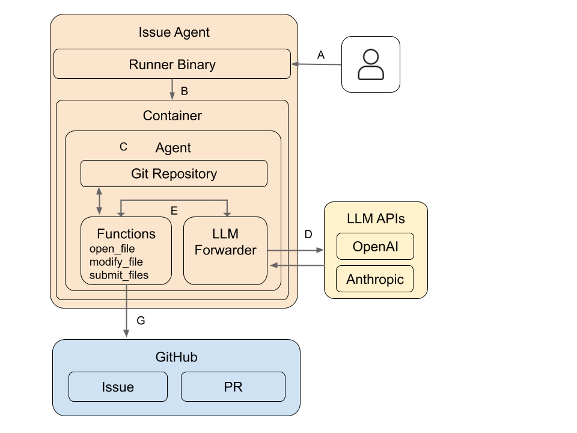
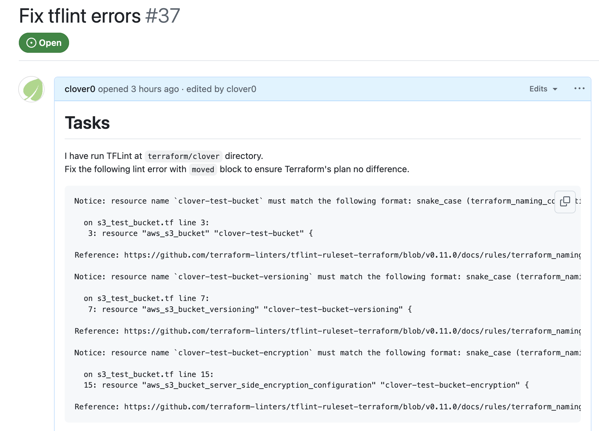
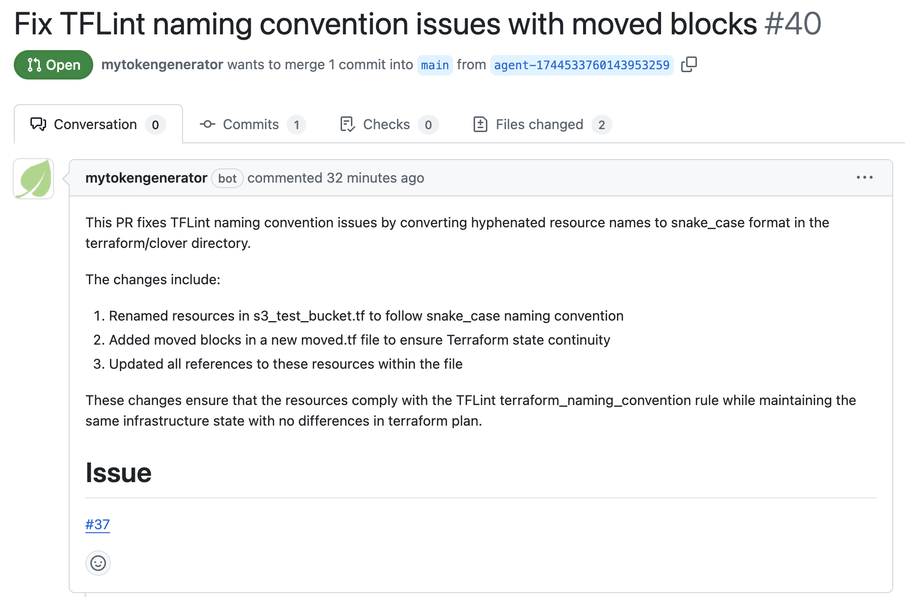
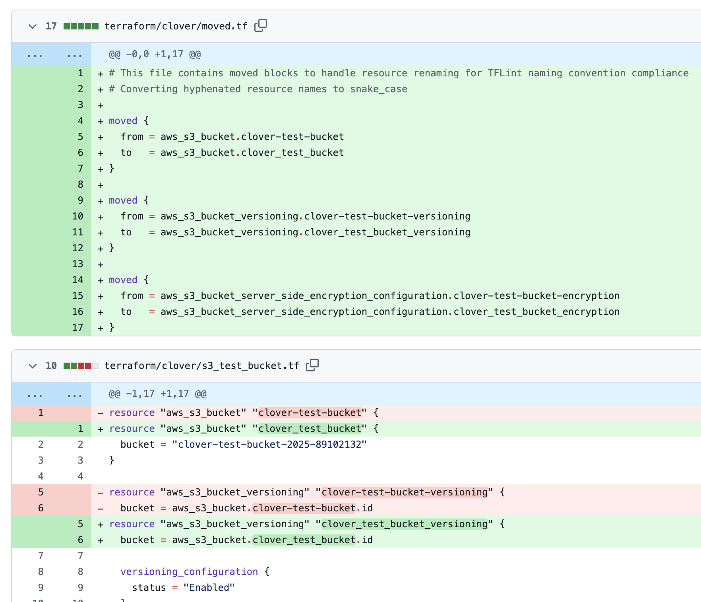

<p align="center">
  <h1 align="center">Issue Agent</h1>
  <p align="center">An AI Agent that quickly solves simple GitHub issues</p>
</p>

---

Powered by Large Language Models (LLMs).

When a developer creates an issue in a repository and passes to this agent, 
it autonomously works to solve the issue and submits its results as a Pull Request on GitHub.

### Design
- **Data transmission is limited to the LLM provider only**
- **Only execution of predefined tools is allowed, not arbitrary shell execution**



## Quick Installation & Usage
### Installation
- [Your Machine](https://clover0.github.io/issue-agent/getting-started/installation/)
- [GitHub Action](https://github.com/clover0/setup-issue-agent)


### Usage

#### CLI
```shell
issue-agent help
```

```shell
$ issue-agent create-pr clover0/example-repository/issues/123 \
  --base_branch main \
  --model claude-3-7-sonnet-20250219
```

#### GitHub Action
1. Set up the workflow file in your repository.
```yaml
name: Run Agent

on:
  issues:
    types:
      - labeled

  create-pr:
    if: ${{ github.event.label.name == 'run-agent' }}
    name: Create PR
    runs-on: ubuntu-latest
    steps:
      - name: Install Issue Agent
        uses: clover0/setup-issue-agent@v1

      - name: configure aws credentials
        uses: aws-actions/configure-aws-credentials@e3dd6a429d7300a6a4c196c26e071d42e0343502 # 4.0.2
        with:
          role-to-assume: "arn:aws:iam::<AWS-ACCOUNT>:role/<ROLE-NAME>"
          role-session-name: run-agent-${{ github.run_id }}
          aws-region: "<AWS-REGION>"

      - uses: actions/create-github-app-token@c1a285145b9d317df6ced56c09f525b5c2b6f755 # v1.11.1
        id: app-token
        with:
          app-id: ${{ secrets.TOKEN_APP_ID }}
          private-key: ${{ secrets.TOKEN_APP_PRIVATE_KEY }}

      - name: Run Issue Agent Action
        run: |
          issue-agent create-pr ${GITHUB_REPOSITORY}/issues/${{ github.event.issue.number }} \
                    --base_branch master \
                    --model us.anthropic.claude-3-7-sonnet-20250219-v1:0 \
                    --aws_region us-east-1
        env:
          GITHUB_TOKEN: ${{ steps.app-token.outputs.token }}
```
See [setup-issue-agent](https://github.com/clover0/setup-issue-agent) for more details.


2. Label the issue with `run-agent` to trigger the workflow.   
In the following example, an issue for refactoring the Terraform code has been created.



3. Issue Agent will create a Pull Request with the solution.




## Documentation
Refer to the [documentation](https://clover0.github.io/issue-agent) for more details.


## Key Features
- **Fully Autonomous**
  - Handles simple coding and documentation tasks without human intervention.

- **Minimal Configuration**
  - Easy to set up: runs locally or via GitHub Actions in minutes.

- **Security**
  - Limited scope: cannot execute arbitrary or unsafe code (only predefined and controlled functions).
  - Never leak credentials or secrets.


## Suitable Use Cases
Issue Agent makes life easier, especially for routine or repetitive tasks:

- **Routine Development Tasks**
  _(e.g., basic migration, formatting, simple refactoring tasks)_
- **Documentation Maintenance**
  _(generate or update consistently formatted docs)_
- **Code Cleanup**
  _(e.g., batch updates, typo corrections, simple bug fixes)_


## Supported AI Models
We recommend Anthropic's Claude models for optimal performance:

| Provider          | Supported Models                                     |
|-------------------|------------------------------------------------------|
| **OpenAI**        | gpt-4o, gpt-4o-mini                                  |
| **Anthropic**⭐️   | claude-3-5-sonnet-latest, claude-3-7-sonnet-20250219 |
| **AWS Bedrock**⭐️ | See AWS Bedrock section                              |


### AWS Bedrock
The following models are supported.

- claude-3-5-sonnet v2 (ModelID = anthropic.claude-3-5-sonnet-20241022-v2:0)
- claude-3-5-sonnet v2 (ModelID = us.anthropic.claude-3-5-sonnet-20241022-v2:0, Cross-region inference)
- claude-3-5-sonnet v1 (ModelID = anthropic.claude-3-5-sonnet-20240620-v1:0)
- claude-3-5-sonnet v1 (ModelID = us.anthropic.claude-3-5-sonnet-20240620-v1:0, Cross-region inference)
- claude-3-7-sonnet (ModelID = anthropic.claude-3-7-sonnet-20250219-v1:0)
- claude-3-7-sonnet (ModelID = us.anthropic.claude-3-7-sonnet-20250219-v1:0, Cross-region inference)
